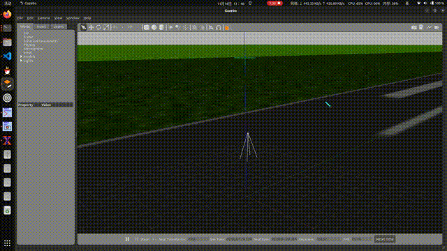
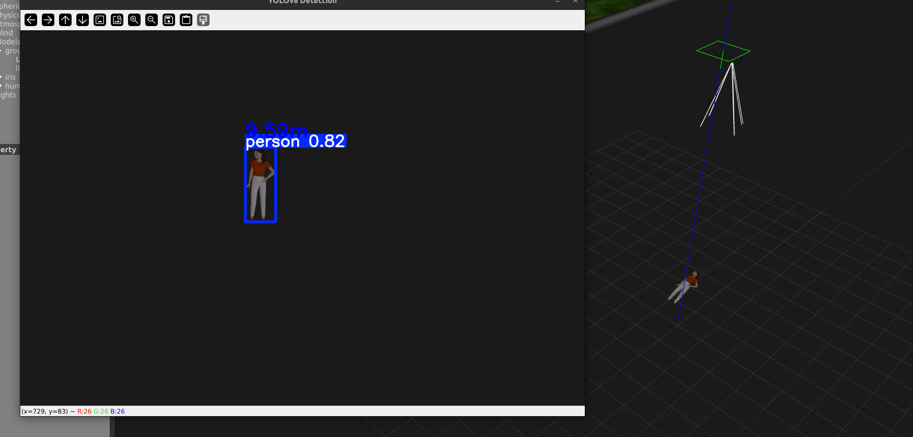
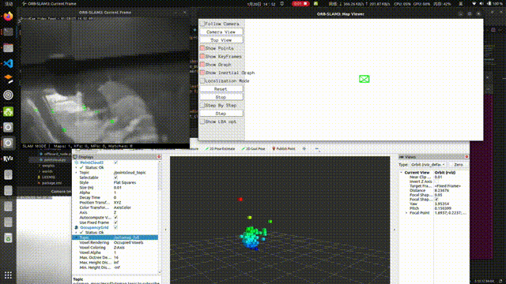

# 🔥概述
一个无人机仿真及建图方案

ubuntu22.04 + ROS2 humble 环境下（其它ROS2可能也可以，但是对应的包需要改版本）：
- 使用ardupilot + mavros + gazebo11 实现无人机控制，使用YOLOv8实现目标检测。
- 使用ORB_SLAM3纯视觉方案实现建图，可以在gazebo仿真环境和现实环境中完成实时建图，或者生成数据后再读取以建图。
- 可以实现pcd点云地图到八叉树地图的转换，八叉树地图可以直接用于后续导航规划。

# 🔥效果
无人机运动：



目标检测（包含深度）：



数据集建图：


手机摄像头建图（八叉树和点云）：



# 🔥参考
环境配置按以下顺序配置，确保通过1实现环境配置，如果要电脑摄像头建图则继续通过2实现配置，如果要gazebo环境建图则继续完成3，如果要手机建图则需要继续安装4，如果建图需要八叉树地图则完成5和6：
1. [Ardupilot + gazebo + mavros 环境构建及控制](https://blog.csdn.net/m0_73885374/article/details/141431462?spm=1001.2014.3001.5506)
2. [ORB_SLAM3 + ORB_SLAM3_ROS2 环境配置及现实摄像头建图](https://blog.csdn.net/m0_73800387/article/details/143316152?ops_request_misc=%257B%2522request%255Fid%2522%253A%25221d6492b7e3d995a389c65a3d10fb8981%2522%252C%2522scm%2522%253A%252220140713.130102334.pc%255Fall.%2522%257D&request_id=1d6492b7e3d995a389c65a3d10fb8981&biz_id=0&utm_medium=distribute.pc_search_result.none-task-blog-2~all~first_rank_ecpm_v1~rank_v31_ecpm-28-143316152-null-null.142^v101^pc_search_result_base2&utm_term=ros2%20%E8%A7%86%E8%A7%89slam&spm=1018.2226.3001.4187)
3. [ORB_SLAM3 在 gazebo 建图](https://blog.csdn.net/m0_73800387/article/details/143436202?spm=1001.2014.3001.5502)
4. [DroidCam 访问手机摄像头](https://www.dev47apps.com/)
5. 安装octomap
```bash
sudo apt install ros-humble-octomap-ros ros-humble-octomap-msgs ros-humble-octomap-server ros-humble-octomap-rviz-plugins
```
6. [修改 ORB_SLAM3 使之保存 pcd 地图](https://blog.csdn.net/qq_45848817/article/details/126024785)

参考仓库：
1. [ORB_SLAM3](https://github.com/UZ-SLAMLab/ORB_SLAM3)
2. [ORB_SLAM3_ROS2](https://github.com/zang09/ORB_SLAM3_ROS2)
3. [YOLOv8](https://github.com/ultralytics/ultralytics)

# 🔥项目结构
- `offboard_pkg`：实现无人机控制和YOLOv8目标检测。
     - `launch`：
         - `apm.launch`：启动mavros，链接ros2和无人机的通信方案。
         - `gazebo.launch.py`：启动gazebo，加载世界和无人机。
         - `octomap.launch.py`：启动octomap，**将点云地图转换为八叉树地图**，在rviz2中可以显示。
     - `materials`：一些材质，官方有。
     - `models/model.sdf`：iris无人机的基础上添加了摄像头等组件，**使用时**复制该文件替换`/home/用户名/.gazebo/models/iris_with_standoffs_demo/model.sdf`。
     - `offboard_pkg`：节点文件。
         - `cam_pc.py`：通过接收电脑摄像头画面发布话题，用于ORB_SLAM3建图。
         - `cam.py`：通过DroidCam连接手机摄像头画面发布话题，用于ORB_SLAM3建图。
         - `circle.py`：启动无人机并绕圈飞行。
         - `image_detection.py`：接收无人机摄像头话题，进行目标检测（包括分类/位置/深度）。
         - `image.py`：接收无人机摄像头话题并显示画面。
         - `moveup.py`：启动无人机并起飞。
         - `offboard_node.py`：启动无人机。
         - `pointcloud.py`：**实时**读取ORB_SLAM3生成的pcd文件，发布点云pointcloud2话题。
     - `weights`：YOLOv8权重文件。
     - `worlds`：世界文件，该文件会调用iris无人机，无人机则需要[安装ardupilot等配置](https://blog.csdn.net/m0_73885374/article/details/141431462?spm=1001.2014.3001.5506)后才能调用。
- `ORB_SLAM3_ROS2`：在[原项目](https://github.com/zang09/ORB_SLAM3_ROS2)基础上进行一些配置设置，是简化后的（去掉双目摄像头等情况），可以不用下载，自行安装再根据自己需求改即可。
- `map.pcd`：某一次生成的地图，可以拿来测试。

# 🔥使用
**注意：确保实现了上述需要的环境配置。**

## 无人机绕圈：
- 在工作区中依次启动终端1-4并运行，项目内文件记得先`source install/setup.bash`：
1. Ardupilot启动（文件不在该项目中）
```bash
sim_vehicle.py -v ArduCopter -f gazebo-iris  --map --console
```
2. gazebo启动
```bash
ros2 launch offboard_pkg gazebo.launch.py
```
3. mavros启动
```bash
ros2 launch offboard_pkg apm.launch
```
4. 控制飞行的节点启动
```bash
ros2 run offboard_pkg circle
```

## 无人机目标检测
5. 在终端1-4的基础上启动目标检测节点
```bash
ros2 run offboard_pkg image_detection
```

## SLAM
- 项目仅仅尝试了**单目摄像头**。
- `/ORB_SLAM3_ROS2/src/monocular/monocular-slam-node.cpp`中订阅的话题应该改成SLAM需要接收的摄像头对应的话题，如果是gazebo环境应该时/chase_cam/image_raw，如果是电脑或手机应该是/camera/image_raw。
- `/ORB_SLAM3_ROS2/config/monocular`中有相机的配置，可以进行自主设置。
- `/ORB_SLAM3_ROS2/vocabulary/ORBvoc.txt.tar.gz`**需要解压**。
6. 如果用gazebo建图就可以在终端1-4的基础上，启动SLAM
```bash
ros2 run orbslam3 mono ./src/ORB_SLAM3_ROS2/vocabulary/ORBvoc.txt ./src/ORB_SLAM3_ROS2/config/monocular/TUM1.yaml
```
7. 如果用实际摄像头建图，只需要在终端6的基础上，电脑和手机摄像头分别启动：
```bash
ros2 run offboard_pkg pc_cam
ros2 run offboard_pkg cam
```
手机还需要多开一个终端启动DroidCam连接手机。
```bash
droidcam
```

## pcd地图转为八叉树地图
如果需要把pcd地图转为八叉树地图，则需要启动8-10脚本。如果需要实时转换，就需要按上述步骤将SLAM所需的脚本启动，反之则只需要有pcd文件即可。
8. 启动点云话题节点，读取pcd文件发布点云话题
```bash
ros2 run offboard_pkg pointcloud
```
9. 启动octomap以转换pcd地图为八叉树地图
```bash
ros2 launch offboard_pkg octomap.launch.py
```
10. 启动rviz可视化地图，按照话题打开`pointcloud_topic`的pointcloud2插件可以查看点云地图，打开`octomap_full`的OccupancyGrid插件可以查看八叉树地图
```bash
rviz2
```

# 🔥总结和展望
- 该项目包含无人机仿真的控制、视觉、建图等多方面功能，算是搭建了相对完整的技术方案和架构，且大部分功能之间比较独立可分离，完成某个功能并不需要启动所有程序。
- 该项目可以实现无人机的简单运动控制，引入目标检测功能，还能通过视觉SLAM进行建图，包括点云和八叉树地图。
- 如果用gazebo建图需要有复杂的仿真场景才能检测到角点进行SLAM，因为ORB这个方案就是用角点检测进行的。
- 后续可以利用八叉树地图进行规划，使得无人机可以借助地图实现实时的导航避障等功能，以完成无人机仿真框架的最后一块拼图。